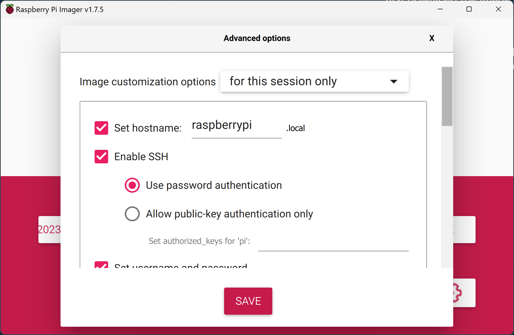
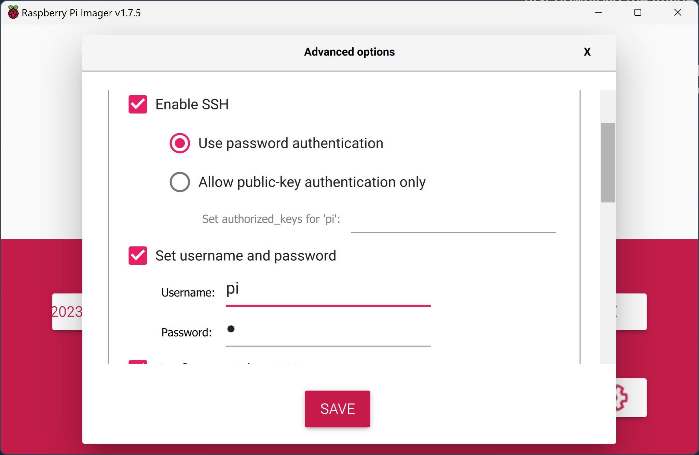
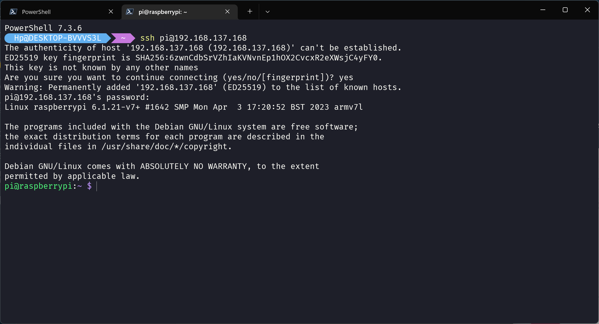

<!-- @format -->

# Raspberry-Pi-4-NAS-setup

Raspberry Pi 4 NAS setup

### first download the image and imager tool

[source](https://www.raspberrypi.com/software/)

### write the image and use that future on imager tool is ssh enable and and many other

### After complete the write then connect with your local network with ethernet interface

## And finally we done

## Update

    `sudo apt-get update`

## Upgrade

    `sudo apt-get upgrade`

## And you can clean and remove your cache file

- ## You can use my onother repository that is i fork from `jabarihunt/Ubuntu-Cleanup-Script`

  ! [source](https://github.com/hamzazahidulislam/Ubuntu-Cleanup-Script)

### I used the lite version of image thats why i have no pre installed git haha :)

### And you can change your password

    `passwd`

## Now thing to do. That is we need to install the main important package that required

- ## Some important this tool are required when we mount our external disk

  `sudo apt install exfat-utils exfat-fuse ntfs-3g`

## Install samba for nas server

    `sudo apt install samba samba-common-bin -y`

## Check the monted disk

    `lsblk`

- ## Out-put

      `NAME        MAJ:MIN RM   SIZE RO TYPE MOUNTPOINT

  mmcblk0 179:0 0 119.1G 0 disk
  ├─mmcblk0p1 179:1 0 256M 0 part /boot
  └─mmcblk0p2 179:2 0 118.8G 0 part /`

## We mount diskt our specif folde that we want. as a NAS folder

    - And add user and create group and link that group policy with samba

## If you want to unmount that write this command

- ## Please remember you see that is example path

  `sudo unmount -R /media/pi/"Ultra Toch" `

  `sudo mkdir ./nas`

  `ls -l`

  `ls -a`

  `sudo chown -R root:users ./nas`

  `sudo chmod -R ug=rwx,o=rx ./nas`

## Now mount our disk

    `sudo mount /dev/sda1 /nas`

## configure the samba file

`sudo nano /etc/samba/smb.conf`

##

### add read only=no

## this is your server destination

`[shared_folder]
   comment = TC Nas Server
   path = /nas
   read only = no
   create mask = 0660
   directory mask = 0771
   public = no
   valid user = samba_pi`

## add user

    `sudo useradd -m -G users samba_pi`
